https://github.com/user-attachments/assets/3efe0be7-c3cc-4c6e-a4f1-f9274d108f65

# boxlib [![Latest Tag][tags/latest-tag-badge]][tags/url] [![License][license-badge]](./LICENSE)<!-- {{{ -->
boxlib is a simple, pure Bash library that provides a collection of APIs for creating TUI (terminal user interface)
applications, such as installers, rescue disks or interactive scripts. It supports both [Whiptail](https://en.wikibooks.org/wiki/Bash_Shell_Scripting/Whiptail) and [Dialog](https://en.wikipedia.org/wiki/Dialog_(software)) as backends for rendering the boxes on the screen.

## Features & Advantages<!-- {{{ -->
- 🧠 **Simple, Practical & Highly Intuitive**
    <br>
    As a library, boxlib lets the developers to write less boilerplate code and more business logic.
    Moreover, it also removes needless complexity, and bridges the gap between Dialog and Whiptail.

- 🌟 **Feature Emulation: Bring Dialog's Exclusive Features to Whiptail**
    <br>
    Whiptail is designed to be drop-in compatible with Dialog, but it lacks several features
    compared to Dialog (e.g., _tailbox_, _timebox_, _calendarbox_, etc.).
    <br>
    boxlib "backports" <ins>all</ins> of the missing boxes into Whiptail by emulating them using
    existing functionality.
    <br>
    For example, the [calendar](#calendar) box is emulated using an [input](#input) field with
    validation. The [file/directory selector](#selector) box and [form](#form) are emulated using
    the [menu](#menu) box.

- 🧩 **Renderer Compatibility**
    <br>
    boxlib aims to be fully compatibile with both Whiptail & Dialog, and offer a consistent and
    unified interface with no need to adapt code per backend.

- 📢 **Communication Between Boxes**
    <br>
    In a multi-level hierarchy, the boxes may need to [communicate](#communication-between-boxes)
    with each other.
    For that, the library puts at your disposal a built-in communication mechanism, which offers
    - <details><summary><strong>Basic Callback Support</strong></summary>

        > You can attach [callback][box-common-options-callback]s (functions, scripts or executables)
        > to individual boxes and capture their result and the status code in a completely isolated way.
        > There are various options to configure the behavior of the callback system, such as
        > [`abortOnRendererFailure`][box-common-options-abort_on_renderer_failure] to fail-fast the
        > whole callback chain and cause the app to exit.
        </details>
    - <details><summary><strong>Callback Status Code Propagation Support</strong></summary>

        > Sometimes, you want to decide in the parent box (e.g., main menu) the specific behavior
        > (e.g., remove entry from menu) depending on state of the child box. For that, you'll have
        > the status code propagation mechanism that allows you to pass the exit code from the child
        > box through the entire callback chain, up to the parent box.
        </details>
    - <details><summary><strong>Callback Environment Propagation Support</strong></summary>

        > Since Bash's scoping mechanism makes local variables behave mostly like actual global
        > variables, it may cause variable pollution and collisions. To address that, boxlib runs
        > all the callbacks in a sandboxed environment (sub-shell). Unfortunately, variable changes
        > won't be visible in the parent. For that, you'll have the callback environment
        > propagation mechanism, that migrates the exported variables to the parent's environment
        > variable space, ensuring the communication between the boxes is always isolated.
        </details>

- 🧭 **Breadcrumb Navigation**
    <br>
    The library implements a breadcrumb stack displayed at the top of the screen to help maintain
    context when exploring multi-level box hierarchies.

- ⚙️ **Global Configuration Per Session**
    <br>
    The library is globally configurable (e.g., select renderer) using [config](#config) component.
    It's also possible to set common box options (e.g., maximize all boxes) once at startup or
    elsewhere during execution.

- 🎯 **Smart Renderer Selection**
    <br>
    The library will automatically decide which utility will be used to render boxes when it's
    imported (sourced) into your project. Dialog is preferred, if available in the system,
    otherwise, it falls back to Whiptail. When neither is found, a panic error is thrown.

- 🖥️ **Cross-platform Compatibility**
    <br>
    The library attempts to be POSIX-compliant in order to offer the same experience across `Linux`,
    `*BSD` and other systems. Tested on the following systems upon release:
    - Ubuntu 22.04
    - FreeBSD 14.2
    - macOS Sonoma (version 14)

- ✨ **...and many more!**
    <br>
    Underneath, the library already includes many things what you'll have to write anyway, so you can
    focus on your app's logic.
    - Want to easily loop a box (e.g. a menu) until user exits? Just set [`loop=true`][box-common-options-loop] option!
    - Need the box size to be 50% of the terminal size? Set [`width=50%`][box-common-options-width]
      and [`height=50%`][box-common-options-height] options to dynamically scale with the terminal!
<!-- }}} -->

## Demo<!-- {{{ -->
Try the [`demo/main.sh`](./demo/main.sh) script to explore all available box/widget types.
You can also run each example individually from the [`demo/`](./demo) directory if you want.
> [!TIP]
> Since Dialog is the preferred renderer, you can force Whiptail by setting the
> [`BOXLIB_USE_WHIPTAIL=1`][global-vars-use-whiptail] environment variable:
> ```bash
> BOXLIB_USE_WHIPTAIL=1 ./demo/main.sh 1 # or BOXLIB_USE_WHIPTAIL=1 bash demo/menu.sh
> ```
<!-- }}} -->

## Example<!-- {{{ -->
Example of a menu box created with Whiptail and with boxlib.

<table><tr><th>Whiptail-only</th><th>the equivalent with boxlib</th></tr>
<tr>
    <td align="center" colspan="2"><p>
        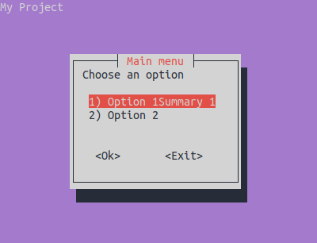
        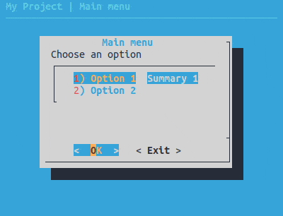
    </p></td>
</tr>
<tr><td>

```bash
declare -a options=(
  '1) Option 1' 'Summary 1'
  '2) Option 2' ''
)
# conditionally hide option
if false; then
  options+=('3) Option 3' 'Summary 3')
fi
while true; do
  if ! result="$(whiptail \
    --backtitle 'My Project' \
    --title 'Main menu'  \
    --cancel-button 'Exit' \
    --menu 'Choose an option' \
    0 0 0 \
    "${options[@]}" \
    3>&1 1>&2 2>&3)"; then
    break
  fi
  # Get rid of the enumeration part
  option="${result#* }"
  case "$result" in
    1*)
      myCallBack1
      ;;
    2*)
      source path/to/callback.sh "$option"
      ;;
    3*)
      myCallBack3
      ;;
    *)
      echo "Unhandled option: $option"
      exit 1
      ;;
  esac
done
```
</td><td>

```bash
source boxlib/core.sh

config headerTitle='My Project'

function menu_handler() {
  local option="$1"
  case "$option" in
    'Option 1') myCallBack1;;
    'Option 3') myCallBack3;;
  esac
}

menu \
  title='Main menu' \
  text='Choose an option' \
  cancelLabel='Exit' \
  callback='menu_handler()' \
  loop='true' \
  prefix='num'

menuEntry \
  title='Option 1' \
  summary='Summary 1'

menuEntry \
  title='Option 2' \
  callback='path/to/callback.sh'

# conditionally hide option
if false; then
  menuEntry \
    title='Option 3' \
    summary='Summary 3'
fi

menuDraw
```
</td></tr>
<tr><td colspan="2">

> [!NOTE]
> You might wonder why the above example is _Whiptail-only_, as the same arguments can be used in Dialog to create a menu box. It's true, but overall behavior will be slightly different. For example, when running with Whiptail, the terminal will be cleared automatically after exiting. Dialog, in turn, requires the `--keep-tite` argument to accomplish this. The boxlib will handle this and bridge many other small gaps between the two for you.

</td></tr>
</table>

See more demos examples [here](./demo).
<!-- }}} -->
<!-- boxlib }}} -->

# Requirements<!-- {{{ -->
- [Whiptail](https://en.wikibooks.org/wiki/Bash_Shell_Scripting/Whiptail)/[Dialog](https://en.wikipedia.org/wiki/Dialog_(software)) as backends for rendering the boxes on the screen
> [!NOTE]
> Both Whiptail and Dialog utilites are pre-installed on most modern systems. Whiptail is available by
> default on Debian-based systems as part of the [Newt](https://en.wikipedia.org/wiki/Newt_(programming_library))
> package, while \*BSD ones provide Dialog or _BSDDialog_.
> boxlib automatically detects and selects the appropriate backend when it's imported (sourced).
- Bash v4.3 (Bash v4.4 recommended)
> [!TIP]
> While Bash v4.3 is fully supported, certain distro-specific builds and patch versions (Bash
> v4.3.48 is the latest) may contain known bugs, that were fixed only in Bash v4.4.
<!-- }}} -->

# Installation Instructions<!-- {{{ -->
1. Create a Git project
    ```console
    git init
    ```

2. Clone this repo into your project using one of the following ways:
    - As submodule
        ```console
        git submodule add --depth=1 https://github.com/iusmac/boxlib.git
        ```
        > If you configure your project using boxlib as submodule, then you and others should it
        > clone with the `--recursive` option:
        > ```console
        > git clone --recursive https://github.com/.../YourProject.git
        > ```
        > It is necessary to _hook_ the boxlib module from `.gitmodules` file during cloning.
    - As subtree
        ```console
        git subtree add --prefix=boxlib https://github.com/iusmac/boxlib.git master --squash
        ```

    <sub><sup>
    [Submodule/Subtree Cheatsheet](https://training.github.com/downloads/submodule-vs-subtree-cheat-sheet/)
   </sub></sup>

3. Create an entrypoint script file (will name it `main.sh`) in the project root directory & make it executable
    ```console
    touch main.sh && chmod +x $_
    ```

    3.1. Import (source) the library core component at the very top of the entrypoint (`main.sh`) file
    ```bash
    #!/usr/bin/env bash

    source boxlib/core.sh
    ```

4. That's it!

    See the [Example](#example) section on how to create your first main menu box.<br>
    For the components provided by the library, refer to the [Components](#components) section.
<!-- }}} -->

# Getting updates<!-- {{{ -->
To get the latest library updates, run the appropriate command in the project root directory:
- **If boxlib is added as submodule**
    ```console
    git submodule update --remote --recursive --force boxlib
    ```
    This command selectively updates only the submodule directory where the library is located.
    You may want to commit the changes.

- **If boxlib added as subtree**
    ```console
    git subtree pull --prefix=boxlib https://github.com/iusmac/boxlib.git master --squash
    ```

<sub><sup>
[Submodule/Subtree Cheatsheet](https://training.github.com/downloads/submodule-vs-subtree-cheat-sheet/)
</sub></sup>
<!-- }}} -->

# Components<!-- {{{ -->
Below is the list of core components that will be available to you anywhere after the library has been imported (sourced).
You can also get the _usage_ screen by invoking the command with `help` argument.

## Config<!-- {{{ -->
Component to globally configure the library and set common box options.

> [!NOTE]
> - Config changes affect only future boxes.
> - Box-specific or Whiptail/Dialog-specific options take precedence over options set via config.

**List of commands:**
<details><summary><code>config &lt;options&gt; [&lt;box-options&gt;]</code></summary><blockquote>

Example usage:
```bash
# Set a custom breadcrumb delimiter and maximize all boxes.
# Also pass the --fb option to all boxes for full buttons
config \
    breadcrumbsDelim=' › ' \
    width='max' \
    height='max' \
    \( --fb \)
text text='This text box should be fully maximized'
text text='This text box should be auto-sized to fit the contents' width='auto' height='auto'
```
<br>

Option             | Default                                        | Description
------------------ | :--------------------------------------------: | -----------
`headerTitle=`     | `""`                                           | <sup id="config-options-header_title"><sub>[#][config-options-header_title]</sub></sup> The string to be displayed on the backdrop, at the top of the screen alongside the breadcrumbs.
`rendererPath=`    | `dialog`                                       | <sup id="config-options-renderer_path"><sub>[#][config-options-renderer_path]</sub></sup> The absolute path to Dialog or Whiptail binary that will render the boxes.
`rendererName=`    | `dialog`                                       | <sup id="config-options-renderer_name"><sub>[#][config-options-renderer_name]</sub></sup> The renderer name when renderer binary is specified.<br>Possible values: `dialog`, `whiptail`.
`breadcrumbsDelim=`| ` > `                                          | <sup id="config-options-breadcrumbs_delim"><sub>[#][config-options-breadcrumbs_delim]</sub></sup> Set the breadcrumb delimiter string. Can by any length.
`debug=`<br>`debug`| `/dev/null`                                    | <sup id="config-options-debug"><sub>[#][config-options-debug]</sub></sup> The file name where to write debug logs. This option takes precedence over the [`BOXLIB_DEBUG`][global-vars-debug] environment variable.<br>When no value is provided, will exit with `0` or `1` indicating the enabled debug state.<table><tr><th>Possible values</th><th></th></tr><tr><td>`stdout`</td><td>prints debug to the standard output</td></tr><tr><td>`stderr`</td><td>prints debug to the standard error</td></tr><tr><td>`<filename>`</td><td>writes debug to the given _filename_.</td></tr></table>
`isDialogRenderer` |                                                | <sup id="config-options-is_dialog_renderer"><sub>[#][config-options-is_dialog_renderer]</sub></sup> Check whether Dialog is the default renderer. Will print `true` or `false` and also exit with `0` or `1`.
`reset`            |                                                | <sup id="config-options-reset"><sub>[#][config-options-reset]</sub></sup> Reset the configuration to defaults.
`help`             |                                                | <sup id="config-options-help"><sub>[#][config-options-help]</sub></sup> Print the usage screen and exit.
</blockquote></details>
<!-- }}} -->

## Box<!-- {{{ -->
Below is the list of box components that allow you to easily launch any Dialog/Whiptail box.
Each box can be configured using two different types of the arguments:
- library-specific options
- Whiptail/Dialog-specific options
> [!NOTE]
> The Whiptail/Dialog-specific options use the special [round bracket syntax][box-common-options-round-bracket-syntax] to pass options to the box. For example:
> ```bash
> # Create an input box with a custom backtitle in lieu of header title & breadcrumb stack
> input \
>   text='My input' \
>   \( --backtitle 'My custom backtitle' \)
> ```
> ```bash
> # The equivalent with Dialog
> dialog \
>   --backtitle 'My custom backtitle' \
>   --inputbox 'My input' 0 0
> ```

See also the [Communication between boxes](#communication-between-boxes) section on how to interact
with boxes and different ways to capture the result.

#### Common options<!-- {{{ -->
Each box may have its own specific options, but all boxes share the following common options:
Option             | Default                                               | Description
------------------ | :---------------------------------------------------: | -----------
`title=`           | `""`                                                  | <sup id="box-common-options-title"><sub>[#][box-common-options-title]</sub></sup> The string that is displayed at the top of the box.<br>Same as using Whiptail/Dialog's `--title` option.
`text=`<br>`text+=`| `""`                                                  | <sup id="box-common-options-text"><sub>[#][box-common-options-text]</sub></sup> The string that is displayed inside the box. The `+=` operator will concatenate with the previous `text=` value (e.g., `info text='very long line1\n' text+='very long line2`).
`width=`           | `auto`<br><sup>_also requires_ `height='auto'`</sup>  | <sup id="box-common-options-width"><sub>[#][box-common-options-width]</sub></sup> The width of the box.<br>Use `auto` or `0` to auto-size to fit the contents. Use `max` or `-1` to maximize.<br>Can be denoted using percent sign, (e.g., `50%`), to adjust dynamically based on the `tput cols` command.
`height=`          | `auto`<br><sup>_also requires_ `width='auto'`</sup>   | <sup id="box-common-options-height"><sub>[#][box-common-options-height]</sub></sup> The height of the box.<br>Use `auto` or `0` to auto-size to fit the contents. Use `max` or `-1` to maximize.<br>Can be denoted using percent sign, (e.g., `50%`), to adjust dynamically based on the `tput lines` command.
`callback=`        |                                                       | <sup id="box-common-options-callback"><sub>[#][box-common-options-callback]</sub></sup> The callback to receive the result(s) from the box. The callback will be:<ul><li>invoked as a local function if it ends with `()`</li><li>executed if it's a file with the "execute" bit set</li><li>sourced as a shell script file if it's none of the above</li></ul>In all cases, the callback should expect the result(s) as input parameters. When executed, the `$?` variable will contain the exit code from the renderer (Whiptail/Dialog).<br><br>**NOTE:**<ul><li>The callback execution will be _sandboxed_, i.e., it will run in a sub-shell. This ensures the interaction is isolated.</li><li>If the callback is a relative path to a file, then it will be searched starting from the working directory.<br>Also, the CWD will be changed to where the callback file is located before executing/sourcing it. To disable, set [`changeToCallbackDir=false`][box-common-options-change_to_callback_dir].</li></ul>

<details><summary align="center"><strong>See All Options</strong></summary>

Option                       | Default                                        | Description
---------------------------- | :--------------------------------------------: | -----------
`changeToCallbackDir=`       | `true`                                         | <sup id="box-common-options-change_to_callback_dir"><sub>[#][box-common-options-change_to_callback_dir]</sub></sup> Whether to change the working directory to where the callback script/executable is located before executing/sourcing it.<br>Possible values: `true` (or `1`), `false` (or `0`).
`abortOnCallbackFailure=`    | `false`                                        | <sup id="box-common-options-abort_on_callback_failure"><sub>[#][box-common-options-abort_on_callback_failure]</sub></sup> Whether to abort immediately when the callback exits with a non-zero code.<br>This will cause the whole callback chain to be interrupted including this box.<br>For example, if applied on the root box that is the entry point for all boxes (e.g., main menu), then the app will exit. Useful for debugging/development purposes or in combination with [`loop=true`][box-common-options-loop] option.<br>Possible values: `true` (or `1`), `false` (or `0`).
`propagateCallbackExitCode=` | `true`                                         | <sup id="box-common-options-propagate_callback_exit_code"><sub>[#][box-common-options-propagate_callback_exit_code]</sub></sup> Whether to propagate the callback exit code instead of the renderer exit code when the box exits.<br>Also, if no callback is provided, the renderer exit code will be used.<br>Possible values: `true` (or `1`), `false` (or `0`).
`alwaysInvokeCallback=`      | `false`                                        | <sup id="box-common-options-always_invoke_callback"><sub>[#][box-common-options-always_invoke_callback]</sub></sup> Whether to invoke the callback even if the renderer (Whiptail/Dialog) exited with a non-zero code.<br>A non-zero code means the user pressed `ESC` key or `Cancel` button or answered `No`.<br>When set to `true`, the callback will always be invoked, and the `$?` variable variable will contain the exit code from the renderer.<br>Possible values: `true` (or `1`), `false` (or `0`).
`printResult=`               | `false`                                        | <sup id="box-common-options-print_result"><sub>[#][box-common-options-print_result]</sub></sup> Whether to print the result(s) to stdout, each on a new line, after the box exits.<br>Possible values: `true` (or `1`), `false` (or `0`).
`abortOnRendererFailure=`    | `false`                                        | <sup id="box-common-options-abort_on_renderer_failure"><sub>[#][box-common-options-abort_on_renderer_failure]</sub></sup> Whether to abort immediately when the box renderer (Whiptail/Dialog) exits with a non-zero code AND with an error message printed to the standard error. No callbacks will be invoked even if [`alwaysInvokeCallback`][box-common-options-always_invoke_callback] option has been used.<br>Useful to fail-fast on renderer errors, such as invalid options.<br>You may also want to combine it with the [`abortOnCallbackFailure=true`][box-common-options-abort_on_callback_failure] option, to cause the whole callback chain, if any, to be interrupted.<br>Possible values: `true` (or `1`), `false` (or `0`).
`loop=`                      | `false`                                        | <sup id="box-common-options-loop"><sub>[#][box-common-options-loop]</sub></sup> Whether to loop the box until it exits with a non-zero code. Mainly useful for [menu](#menu)s or when used in combination with [`abortOnCallbackFailure=true`][box-common-options-abort_on_callback_failure] to control the loop granularly.<br>Possible values: `true` (or `1`), `false` (or `0`).
`hideBreadcrumb=`            | `false`                                        | <sup id="box-common-options-hide_breadcrumb"><sub>[#][box-common-options-hide_breadcrumb]</sub></sup> Whether to hide the box from the breadcrumbs stack displayed at the top of the screen.<br>Possible values: `true` (or `1`), `false` (or `0`).
`sleep=`                     |                                                | <sup id="box-common-options-sleep"><sub>[#][box-common-options-sleep]</sub></sup> Sleep (delay) for the given number of seconds after the box exits with a zero code.<br>Useful when a pause is needed before displaying the next box.<br>NOTE: this is not the same as using Dialog's `--sleep` option. Instead, the `sleep` command will be used after the box has been cleared.
`timeout=`                   |                                                | <sup id="box-common-options-timeout"><sub>[#][box-common-options-timeout]</sub></sup> Timeout (exit with error code) if no user response within the given number of seconds. Same as using Dialog's `--timeout` option. This behavior is replicated internally by the library when using Whiptail.<br>A timeout of zero seconds is ignored and the decimal part will be dropped.
`term=`                      | `$TERM`                                        | <sup id="box-common-options-term"><sub>[#][box-common-options-term]</sub></sup> The value for the `$TERM` variable that will be used to render this box.
`( --opt val ... )`          |                                                | <sup id="box-common-options-round-bracket-syntax"><sub>[#][box-common-options-round-bracket-syntax]</sub></sup> The special round bracket syntax to pass Whiptail/Dialog-specific options to the box, as if used on the command line. It can be used multiple times in any order.<br>NOTE: since parentheses are special to the shell, you will usually need to escape or quote them.<br>Example usage:<br>`text title='Welcome' text='Hello World!' \( --backtitle 'My backtitle' --fb \)`
`yesLabel=`                  |                                                | <sup id="box-common-options-yes_label"><sub>[#][box-common-options-yes_label]</sub></sup> Set the text of the `Yes` button.<br>Same as using Whiptail/Dialog's `--yes-button/--yes-label` option.
`noLabel=`                   |                                                | <sup id="box-common-options-no_label"><sub>[#][box-common-options-no_label]</sub></sup> Set the text of the `No` button.<br>Same as using Whiptail/Dialog's `--no-button/--no-label` option.
`okLabel=`                   |                                                | <sup id="box-common-options-ok_label"><sub>[#][box-common-options-ok_label]</sub></sup> Set the text of the `Ok` button.<br>Same as using Whiptail/Dialog's `--ok-button/--ok-label` option.
`cancelLabel=`               |                                                | <sup id="box-common-options-cancel_label"><sub>[#][box-common-options-cancel_label]</sub></sup> Set the text of the `Cancel` button.<br>Same as using Whiptail/Dialog's `--cancel-button/--cancel-label` option.
`scrollbar=`                 | `false`                                        | <sup id="box-common-options-scrollbar"><sub>[#][box-common-options-scrollbar]</sub></sup> Whether to force the display of a vertical scrollbar.<br>Same as using Whiptail/Dialog's `--scrolltext/--scrollbar` option.<br>Possible values: `true` (or `1`), `false` (or `0`).
`topleft=`                   | `false`                                        | <sup id="box-common-options-topleft"><sub>[#][box-common-options-topleft]</sub></sup> Whether to put window in top-left corner.<br>Same as using Whiptail/Dialog's `--topleft/--begin 0 0` option.<br>Possible values: `true` (or `1`), `false` (or `0`).
`help`                       |                                                | <sup id="box-common-options-help"><sub>[#][box-common-options-help]</sub></sup> Print the usage screen and exit.
</blockquote></details>

---
<!-- }}} -->

### Calendar<!-- {{{ -->
Component to set up a new calendar box and perform drawing to the terminal. Corresponds to the `--calendar` argument in Dialog.
> [!NOTE]
> In Whiptail, this feature is emulated using an [input](#input) field with validation.
> The output (as well as the input) defaults to the format `dd/mm/yyyy`.

<details><summary><strong>Demo</strong> | <a href="./demo/calendar.sh">Show example code</a></summary>

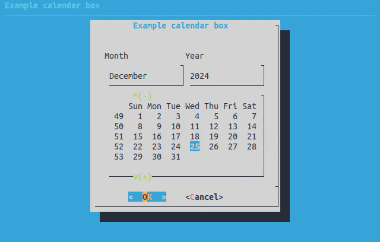
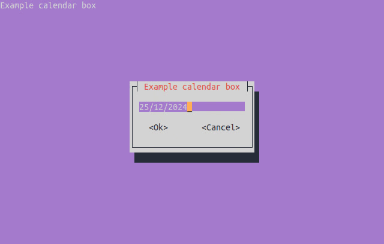
</details>

**List of commands:**
<details><summary><code>calendar &lt;options&gt;</code></summary><blockquote>

Sets up a new calendar box and draws it.
Option             | Default                                        | Description
------------------ | :--------------------------------------------: | -----------
`day=`             | _(current day)_                                | <sup id="calendar-options-day"><sub>[#][calendar-options-day]</sub></sup> The day of the calendar.<br>Example: `25`.
`month=`           | _(current month)_                              | <sup id="calendar-options-month"><sub>[#][calendar-options-month]</sub></sup> The month of the calendar.<br>Example: `12`.
`year=`            | _(current year)_                               | <sup id="calendar-options-year"><sub>[#][calendar-options-year]</sub></sup> The year of the calendar.<br>Example: `2024`.
`dateFormat=`      | `%d/%m/%Y`                                     | <sup id="calendar-options-date_format"><sub>[#][calendar-options-date_format]</sub></sup> The format of the outputted date string.<br>NOTE: in Dialog, the `--date-format` option will be used, which relies on `strftime`, whereas in Whiptail, the `date` command will be used. So, there may be slight differences in the format specifiers.
`forceInputBox=`   | `false`                                        | <sup id="calendar-options-force_input_box"><sub>[#][calendar-options-force_input_box]</sub></sup> Whether to force use of the [input](#input) box instead of the Dialog's calendar.<br>Possible values: `true` (or `1`), `false` (or `0`).

[<strong>See Common Options</strong>](#common-options)
</blockquote></details>

---
<!-- }}} -->

### Confirm<!-- {{{ -->
Component to set up a new confirm box and perform drawing to the terminal. Corresponds to the `--yesno` argument in _Dialog/Whiptail_.

<details><summary><strong>Demo</strong> | <a href="./demo/confirm.sh">Show example code</a></summary>

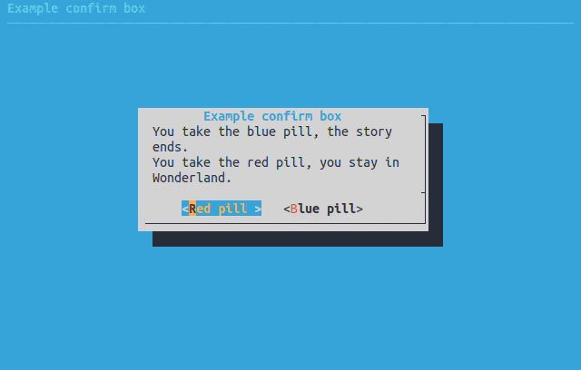
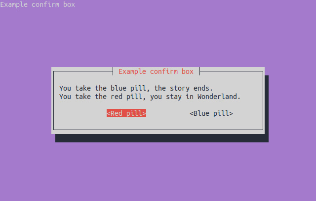
</details>

**List of commands:**
<details><summary><code>confirm &lt;options&gt;</code></summary><blockquote>

Sets up a new confirm box and draws it.

[<strong>See Common Options</strong>](#common-options)
</blockquote></details>

---
<!-- }}} -->

### Edit<!-- {{{ -->
Component to set up a new edit box and perform drawing to the terminal. Corresponds to the `--editbox` argument in Dialog.
> [!NOTE]
> In Whiptail, unless [`editor`][edit-options-editor] option is provided, the default editor will be used instead.

<details><summary><strong>Demo</strong> | <a href="./demo/edit.sh">Show example code</a></summary>

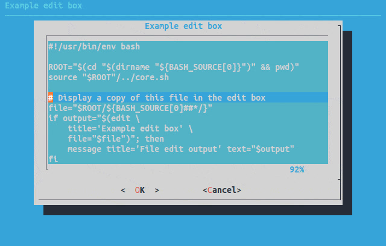
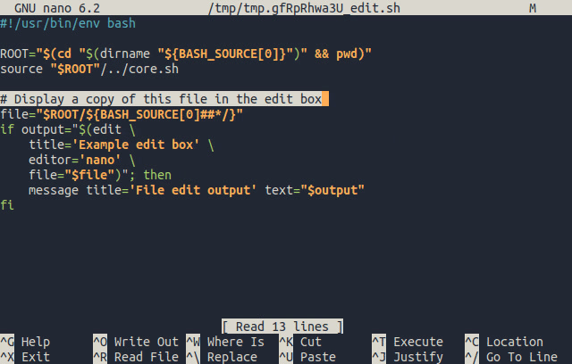
</details>

**List of commands:**
<details><summary><code>edit &lt;options&gt;</code></summary><blockquote>

Sets up a new edit box and draws it.
Option             | Default                                        | Description
------------------ | :--------------------------------------------: | -----------
`file=`            |                                                | <sup id="edit-options-file"><sub>[#][edit-options-file]</sub></sup> The path to a file whose contents to edit.
`editor=`          |                                                | <sup id="edit-options-editor"><sub>[#][edit-options-editor]</sub></sup> The text editor to use. If an empty string is provided, the "good" default text editor will be determined via Debian's `sensible-editor` helper command. Otherwise, the editor from the `$EDITOR` or `$VISUAL` environment variables, or one of `nano`, `nano-tiny`, or `vi`.<br>This option can be used with Dialog as well to replace the edit box.
`inPlace=`         | `false`                                        | <sup id="edit-options-in_place"><sub>[#][edit-options-in_place]</sub></sup> Whether to edit the file in place after the box/editor exits.<br>Possible values: `true` (or `1`), `false` (or `0`).

[<strong>See Common Options</strong>](#common-options)
</blockquote></details>

---
<!-- }}} -->

### Form<!-- {{{ -->
Component to set up a form box and perform drawing to the terminal. Corresponds to the `--form`, `--mixedform`
& `--passwordform` arguments in Dialog.
> [!NOTE]
> In Whiptail, this feature is emulated using a normal [menu](#menu) and an [input](#input) box to edit the fields.

> [!TIP]
> Use up/down arrows (or control/N, control/P) to move between fields.
>
> Unless a callback is specified via [`callback`][box-common-options-callback] option on the box, on exit, the contents
> of the form-fields are written to the standard output, each field separated by a newline. The text used to fill
> non-editable fields ([`width`][form_field-options-width] is zero or negative) is not written out.

<details><summary><strong>Demo</strong> | <a href="./demo/form.sh">Show example code</a></summary>

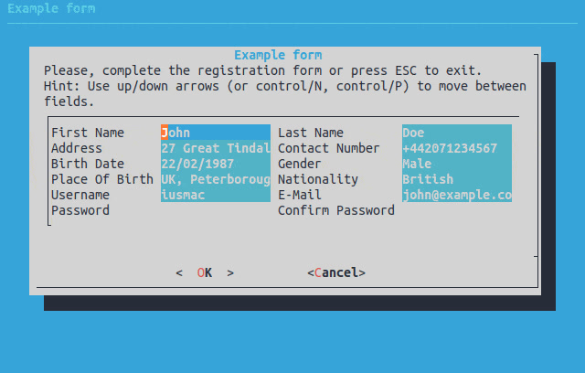
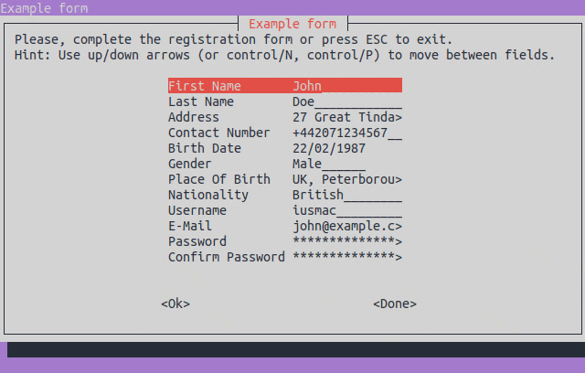
</details>

**List of commands:**
<details><summary><code>form &lt;options&gt;</code></summary><blockquote><!-- {{{ -->

Sets up a new form box.
Option             | Default                                        | Description
------------------ | :--------------------------------------------: | -----------
`formHeight=`      | `auto`                                         | <sup id="form-options-form_height"><sub>[#][form-options-form_height]</sub></sup> The form height, which determines the amount of rows to be displayed at one time, but the form will be scrolled if there are more rows than that.<br>Use `auto` or `0` to auto-size to fit the contents.<br>Can be denoted using percent sign, (e.g., `50%`), to adjust dynamically based on the amount of rows.
`columns=`         | `1`                                            | <sup id="form-options-columns"><sub>[#][form-options-columns]</sub></sup> The number of columns per row before wrapping fields to a new line. Using this, will effectively lay out, align, and distribute fields within the Dialog's window.<ul><li>If set to `0`, all the fields should be manually positioned using coordinates.</li><li>If set to `1` or higher, fields will be arranged automatically. The individual field coordinates can still be overridden.</li></ul>
`fieldWidth=`      |                                                | <sup id="form-options-field_width"><sub>[#][form-options-field_width]</sub></sup> The default field width.
`fieldMaxLength=`  |                                                | <sup id="form-options-field_max_length"><sub>[#][form-options-field_max_length]</sub></sup> The default permissible length of the data that can be entered in the fields.
`[ opt=val ... ]`  |                                                | <sup id="form-options-square-bracket-syntax"><sub>[#][form-options-square-bracket-syntax]</sub></sup> The special square bracket syntax to add form-fields, which accepts [`formField`][form_field] options as-is. For example:<br><code>form title='My form' [ title='First Name' width=10 ] [ ... ]</code>

[<strong>See Common Options</strong>](#common-options)
</blockquote></details>
<!-- }}} -->

<details><summary><code id="form_field">formField &lt;options&gt;</code></summary><blockquote><!-- {{{ -->

Adds a form entry. This can only be used after the form box has been set up.
Fields will appear in the form in the order they are added.
Option             | Default                                        | Description
------------------ | :--------------------------------------------: | -----------
`type=`            | `input`                                        | <sup id="form_field-options-type"><sub>[#][form_field-options-type]</sub></sup> The type(s) of the field. The field can combine multiple types, for example: `hidden\|readonly`.<table><tr><th>Possible values</th><th></th></tr><tr><td>`input`</td><td>A standard input field that allows to enter and edit text</td></tr><tr><td>`hidden`</td><td>A field that stores sensitive data not visible to the user,<br>like passwords</td></tr><tr><td>`readonly`</td><td>A non-editable field that displays information to the<br>user, similar to a label</td></tr></table>
`title=`           | `""`                                           | <sup id="form_field-options-title"><sub>[#][form_field-options-title]</sub></sup> The title/label of the field.
`value=`           | `""`                                           | <sup id="form_field-options-value"><sub>[#][form_field-options-value]</sub></sup> The initial value of the field.
`width=`           | `0`                                            | <sup id="form_field-options-width"><sub>[#][form_field-options-width]</sub></sup> The width of the field that determines the number of characters that the user can see when editing the value.<ul><li>If width value is 0, the field cannot be altered, and the contents of the field determine the displayed-length.</li><li>If width value is negative, the field cannot be altered, and the negated value is used to determine the displayed-length.</li></ul>
`maxlength=`       | `0`                                            | <sup id="form_field-options-maxlength"><sub>[#][form_field-options-maxlength]</sub></sup> The permissible length of the data that can be entered in the field. When value is `0`, the value of [`width`][form_field-options-width] is used instead.
`titleX=`          |                                                | <sup id="form_field-options-title_x"><sub>[#][form_field-options-title_x]</sub></sup> The x-coordinate of the field's title within the form's window.<br>This is automatically computed if [`columns`][form-options-columns] option is > `0`, and a value starting with `+` or `-` can be used to adjust (increase or decrease) the automatically computed title's position by that amount.<br>The unit of measurement is terminal columns.
`titleY=`          |                                                | <sup id="form_field-options-title_y"><sub>[#][form_field-options-title_y]</sub></sup> The y-coordinate of the field's title within the form's window.<br>This is automatically computed if [`columns`][form-options-columns] option is > `0`, and a value starting with `+` or `-` can be used to adjust (increase or decrease) the automatically computed title's position by that amount.<br>The unit of measurement is terminal rows.
`valueX=`          |                                                | <sup id="form_field-options-value_x"><sub>[#][form_field-options-value_x]</sub></sup> The x-coordinate of the field's value within the form's window.<br>Typically, you want it to be `${#title} + 2` (+2 is for padding) in order for it to be positioned next to the title.<br>This is automatically computed if [`columns`][form-options-columns] option is > `0`, and a value starting with `+` or `-` can be used to adjust (increase or decrease) the automatically computed value's position by that amount.<br>The unit of measurement is terminal columns.
`valueY=`          |                                                | <sup id="form_field-options-value_y"><sub>[#][form_field-options-value_y]</sub></sup> The y-coordinate of the field's value within the form's window.<br>Typically, you want it to be the same as [`titleY`][form_field-options-title_y].<br>This is automatically computed if [`columns`][form-options-columns] option is > `0`, and a value starting with `+` or `-` can be used to adjust (increase or decrease) the automatically computed value's position by that amount.<br>The unit of measurement is terminal rows.
`help`             |                                                | <sup id="form_field-options-help"><sub>[#][form_field-options-help]</sub></sup> Print the usage screen and exit.
</blockquote></details>

<details><summary><code>formDraw</code></summary><blockquote>

Performs the actual drawing of the form. This can only be used after the form box has been fully set up.
Option             | Description
------------------ | -----------
`help`             | <sup id="form_draw-options-help"><sub>[#][form_draw-options-help]</sub></sup> Print the usage screen and exit.
</blockquote></details>
<!-- }}} -->

---
<!-- }}} -->

### Info<!-- {{{ -->
Component to set up a new input box and perform drawing to the terminal. Corresponds to the `--infobox` argument in _Dialog/Whiptail_.

> [!TIP]
> Due to an old [bug](https://bugs.launchpad.net/ubuntu/+source/newt/+bug/604212), Whiptail fails to
> render the info box in an xterm-based terminals (e.g., gnome-terminal). As a workaround, boxlib
> implicitly uses `linux` terminfo whenever `$TERM` matches `xterm*` or `*-256color`. The `linux`
> terminfo has color support, but if it doesn't work for you, try setting the [`term`][box-common-options-term]
> option to `vt220` or `ansi` instead.

<details><summary><strong>Demo</strong> | <a href="./demo/info.sh">Show example code</a></summary>

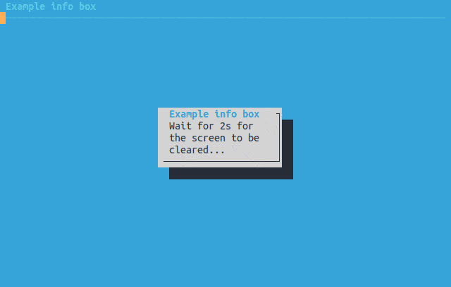
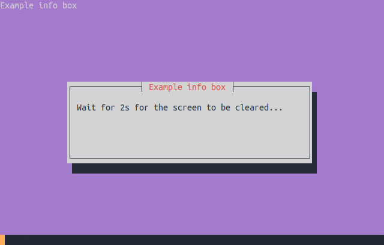
</details>

**List of commands:**
<details><summary><code>info &lt;options&gt;</code></summary><blockquote>

Sets up a new info box and draws it.
Option             | Default                                        | Description
------------------ | :--------------------------------------------: | -----------
`clear=`           | `false`                                        | <sup id="info-options-clear"><sub>[#][info-options-clear]</sub></sup> Whether to clear the screen after the box exits. Unless specified otherwise, this option is implicitly set to `true` when combined with the [`sleep`][box-common-options-sleep] option.<br>Possible values: `true` (or `1`), `false` (or `0`).

[<strong>See Common Options</strong>](#common-options)
</blockquote></details>

---
<!-- }}} -->

### Input<!-- {{{ -->
Component to set up a new input box and perform drawing to the terminal. Corresponds to the `--inputbox` & `--passwordbox` arguments in _Dialog/Whiptail_.

<details><summary><strong>Demo</strong></summary>

<details><summary>input | <a href="./demo/input.sh">Show example code</a></summary>

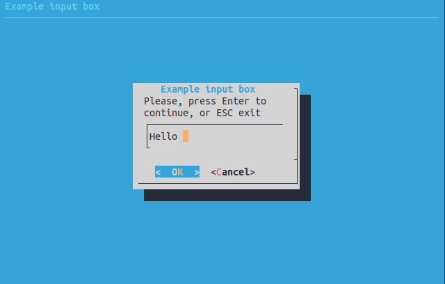
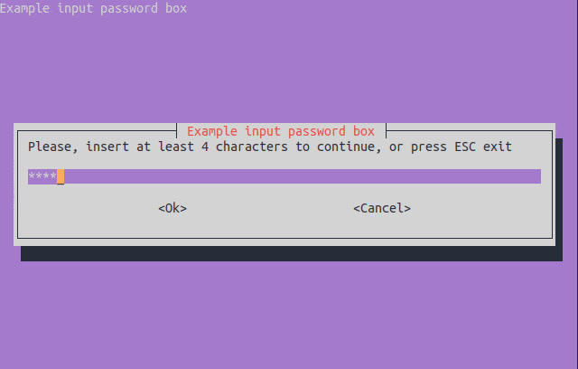
</details>

<details><summary>password | <a href="./demo/password.sh">Show example code</a></summary>

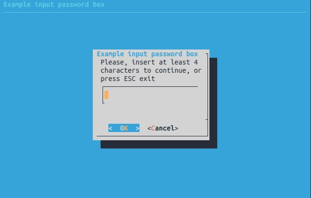
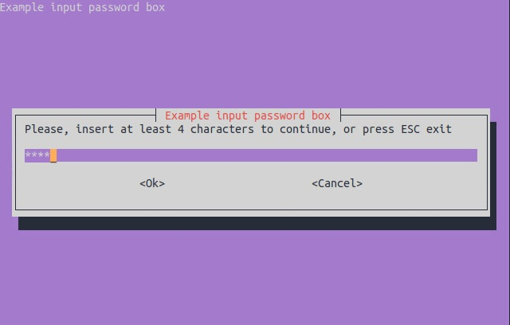
</details>
</details>

**List of commands:**
<details><summary><code>input &lt;options&gt;</code></summary><blockquote>

Sets up a new input box and draws it.
Option             | Default                                        | Description
------------------ | :--------------------------------------------: | -----------
`type=`            | `text`                                         | <sup id="input-options-type"><sub>[#][input-options-type]</sub></sup> The type of the input box.<br>Possible values: `text`, `password`.
`value=`           | `""`                                           | <sup id="input-options-value"><sub>[#][input-options-value]</sub></sup> The value used to initialize the input string.

[<strong>See Common Options</strong>](#common-options)
</blockquote></details>

---
<!-- }}} -->

### List<!-- {{{ -->
Component to set up a new list box, add choice entries and perform drawing to the terminal. Corresponds to the `--buildlist`, `--checklist`, `--radiolist` &`--treeview` arguments in _Dialog/Whiptail_.
> [!NOTE]
> In Whiptail, the buildlist feature is emulated using the [checklist](#list) box.
> The treeview feature is emulated using the [radiolist](#list) box.

<details><summary><strong>Demo</strong></summary>
<details><summary>build list | <a href="./demo/buildlist.sh">Show example code</a></summary>


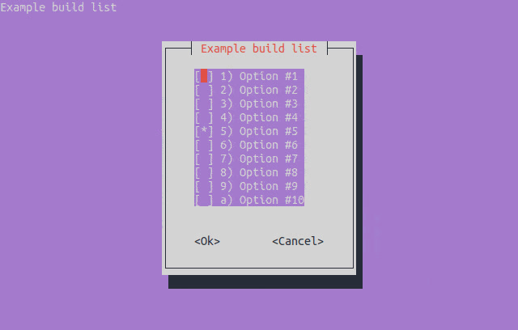
</details>

<details><summary>checkbox list | <a href="./demo/checklist.sh">Show example code</a></summary>

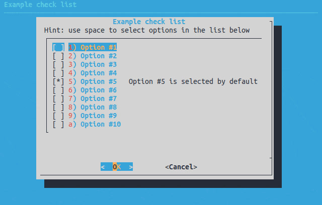
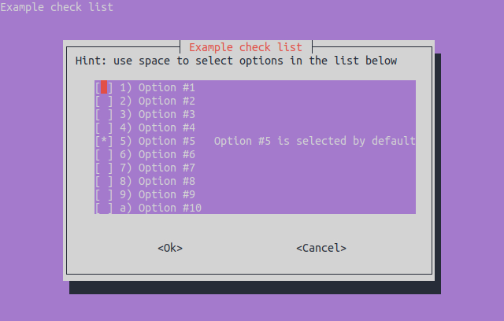
</details>

<details><summary>radiobox list | <a href="./demo/radiolist.sh">Show example code</a></summary>

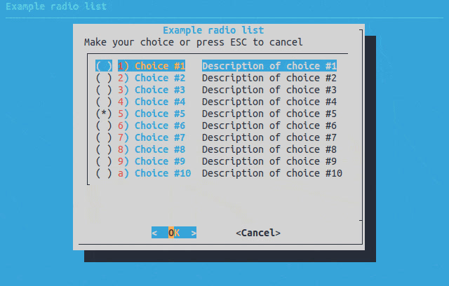
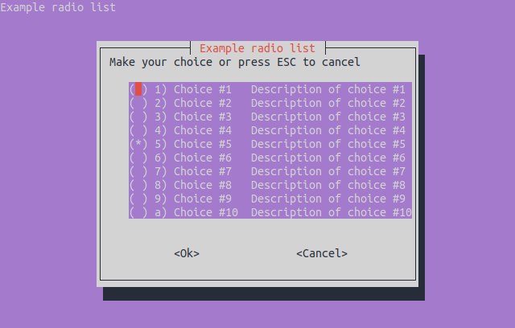
</details>

<details><summary>tree list | <a href="./demo/treelist.sh">Show example code</a></summary>

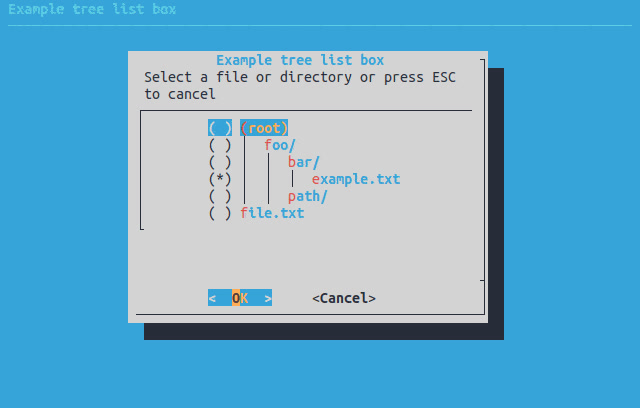
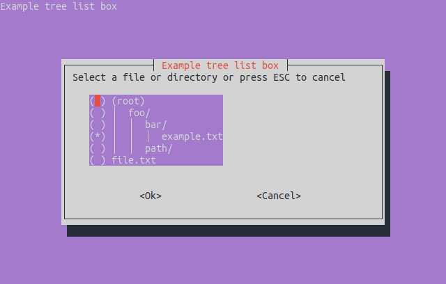
</details>

</details>
</details>

**List of commands:**
<details><summary><code>list &lt;options&gt;</code></summary><blockquote><!-- {{{ -->

Sets up a new list box.
Option             | Default                                        | Description
------------------ | :--------------------------------------------: | -----------
`type=`            | `check`                                        | <sup id="list-options-type"><sub>[#][list-options-type]</sub></sup> The type of the list box.<table><tbody><tr><th>Possible values</th><th></th></tr><tr><td><code>build</code></td><td>displays two lists, side-by-side. The results are written<br>in the order displayed in the selected-window.</td></tr><tr><td><code>check</code></td><td>similar to a [menu](#menu), but allows to select either many<br>entries or none at all.<br>The results are written in the order displayed in the<br>window.</td></tr><tr><td><code>radio</code></td><td>similar to a [menu](#menu), but allows to select either a single<br>entry or none at all.</td></tr><tr><td><code>tree</code></td><td>similar to a radio list, but displays entries organized<br>as a tree. The depth is controlled using the [`depth`][list_entry-options-depth].<br>The entry [`title`][list_entry-options-title] is not displayed. After selecting an<br>entry, the entry title is the output.</td></tr></tbody></table>
`listHeight=`      | `auto`                                         | <sup id="list-options-list_height"><sub>[#][list-options-list_height]</sub></sup> The list height, which determines the amount of choices to be displayed at one time, but the list will be scrolled if there are more entries than that.<br>Use `auto` or `0` to auto-size to fit the contents.<br>Can be denoted using percent sign, (e.g., `50%`), to adjust dynamically based on the amount choices.
`prefix=`          |                                                | <sup id="list-options-prefix"><sub>[#][list-options-prefix]</sub></sup> Whether to prefix the entry titles in the list with enumeration, alphabetic letter, or both. This is especially useful for quickly selecting a choice using the keyboard.<br>Unless the [`keepPrefix`][list-options-keep_prefix] option is used, the prefix will be stripped off before printing/returning the result.<table><tr><th>Possible values</th><th></th></tr><tr><td>`num`</td><td>cardinal number: `1`, `2`, `3` ... `15`, `16` ...</td></tr><tr><td>`alpha`</td><td>alphabet letter: `a-z` (after `z`, it goes back to `a`)</td></tr><tr><td>`alphanum`</td><td>alphanumeric: `1-9,a-z` (after `z`, it goes back to `1`)</td></tr><tr><td>`alphanum0`</td><td>full alphanumeric: `0-9,a-z` (after `z`, it goes back<br>to `0`)</td></tr><tr><td>`alphanum1`</td><td>hybrid alphanumeric: `1-9,0,a-z`(after `z`, it goes<br>back to `1`)</td></tr></table>
`keepPrefix=`      | `false`                                        | <sup id="list-options-keep_prefix"><sub>[#][list-options-keep_prefix]</sub></sup> Whether to keep the prefix in the selected entry when printing/returning the result.<br>This can be useful if you want to use the prefix initials to match entries.<br>Possible values: `true` (or `1`), `false` (or `0`).
`[ opt=val ... ]`  |                                                | <sup id="list-options-square-bracket-syntax"><sub>[#][list-options-square-bracket-syntax]</sub></sup> The special square bracket syntax to add list choices, which accepts [`listEntry`][list_entry] options as-is. For example:<br><code>list title='My list' [ title='Option 1' summary='Summary 1' ] [ ... ]</code>

[<strong>See Common Options</strong>](#common-options)
</blockquote></details>
<!-- }}} -->

<details><summary><code id="list_entry">listEntry &lt;options&gt;</code></summary><blockquote><!-- {{{ -->

Adds a choice entry. This can only be used after the list box has been set up.
Choice entries will appear in the list in the order they are added.
Option             | Default                                        | Description
------------------ | :--------------------------------------------: | -----------
`title=`           | `""`                                           | <sup id="list_entry-options-title"><sub>[#][list_entry-options-title]</sub></sup> The title of the choice entry.
`summary=`         | `""`                                           | <sup id="list_entry-options-summary"><sub>[#][list_entry-options-summary]</sub></sup> The summary of the entry.
`selected=`        | `false`                                        | <sup id="list_entry-options-selected"><sub>[#][list_entry-options-selected]</sub></sup> Whether to preselect the choice.<br>Possible values: `true` (or `1`), `false` (or `0`).
`depth=`           | `0`                                            | <sup id="list_entry-options-depth"><sub>[#][list_entry-options-depth]</sub></sup> The depth of the entry in the tree list.
`callback=`        |                                                | <sup id="list_entry-options-callback"><sub>[#][list_entry-options-callback]</sub></sup> The callback to invoke when this entry is selected in the list. The callback will be:<ul><li>invoked as a local function if it ends with `()`</li><li>executed if it's a file with the "execute" bit set</li><li>sourced as a shell script file if it's none of the above</li></ul>In all cases, the callback should expect the title of the selected entry as first input parameter. When executed, the `$?` variable will contain the exit code from the renderer (Whiptail/Dialog).<br><br>**NOTE:**<ul><li>This option takes precedence over the list's [`callback`][box-common-options-callback] parameter.</li><li>The callback execution will be _sandboxed_, i.e., it will run in a sub-shell. This ensures the interaction is isolated.</li><li>If the callback is a relative path to a file, then it will be searched starting from the working directory.<br>Also, the CWD will be changed to where the callback file is located before executing/sourcing it. To disable, set [`changeToCallbackDir=false`][box-common-options-change_to_callback_dir].</li></ul>
`help`             |                                                | <sup id="list_entry-options-help"><sub>[#][list_entry-options-help]</sub></sup> Print the usage screen and exit.
</blockquote></details>
<!-- }}} -->

<details><summary><code>listDraw</code></summary><blockquote><!-- {{{ -->

Performs the actual drawing of the list. This can only be used after the list box has been fully set up.
Option             | Description
------------------ | -----------
`help`             | <sup id="list_draw-options-help"><sub>[#][list_draw-options-help]</sub></sup> Print the usage screen and exit.
</blockquote></details>
<!-- }}} -->

---
<!-- }}} -->

### Menu<!-- {{{ -->
Component to set up a new menu box, add menu entries and perform drawing to the terminal. Corresponds to the `--menu` & `--inputmenu` arguments in _Dialog/Whiptail_.

> [!NOTE]
> In Whiptail, the input menu is simulated using a normal [menu](#menu) and an [input](#input) box allowing you to edit
> the menu entry summary when it is selected, similar to how it works in Dialog.

<details><summary><strong>Demo</strong></summary>
<details><summary>menu | <a href="./demo/menu.sh">Show example code</a></summary>

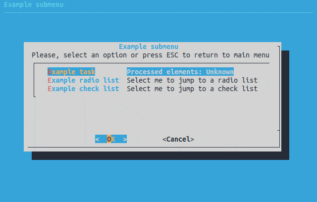
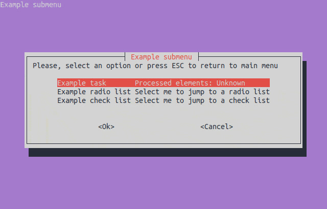
</details>

<details><summary>input menu | <a href="./demo/inputmenu.sh">Show example code</a></summary>

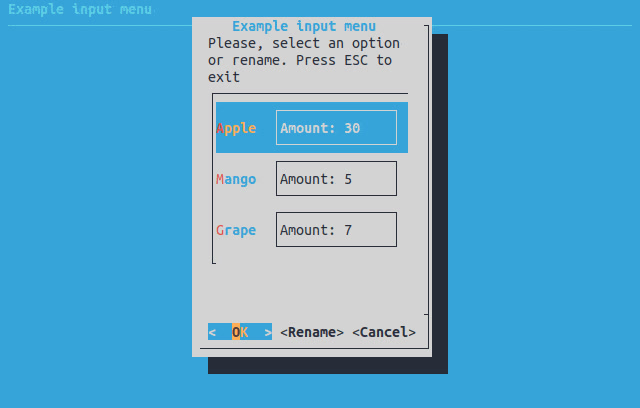
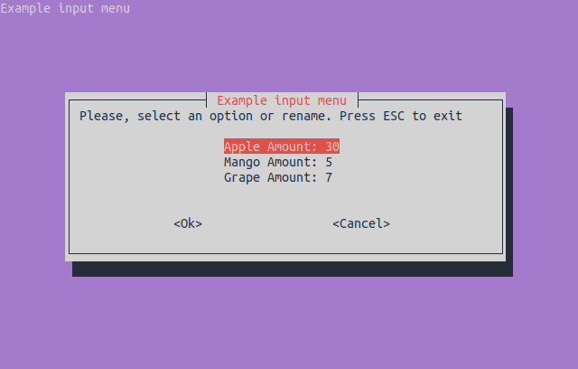
</details>
</details>

**List of commands:**
<details><summary><code>menu &lt;options&gt;</code></summary><blockquote><!-- {{{ -->

Sets up a new menu box.
Option             | Default                                        | Description
------------------ | :--------------------------------------------: | -----------
`menuHeight=`      | `auto`                                         | <sup id="menu-options-menu_height"><sub>[#][menu-options-menu_height]</sub></sup> The menu height, which determines the amount of entries to be displayed at one time, but the menu will be scrolled if there are more entries than that.<br>Use `auto` or `0` to auto-size to fit the contents.<br>Can be denoted using percent sign, (e.g., `50%`), to adjust dynamically based on the amount of menu entries.
`prefix=`          |                                                | <sup id="menu-options-prefix"><sub>[#][menu-options-prefix]</sub></sup> Whether to prefix the entry titles in the list with enumeration, alphabetic letters, or both. This is especially useful for quickly selecting an entry using the keyboard.<br>Unless the [`keepPrefix`][menu-options-keep_prefix] option is used, the prefix will be stripped off before printing/returning the result.<table><tr><th>Possible values</th><th></th></tr><tr><td>`num`</td><td>cardinal number: `1`, `2`, `3` ... `15`, `16` ...</td></tr><tr><td>`alpha`</td><td>alphabet letter: `a-z` (after `z`, it goes back to `a`)</td></tr><tr><td>`alphanum`</td><td>alphanumeric: `1-9,a-z` (after `z`, it goes back to `1`)</td></tr><tr><td>`alphanum0`</td><td>full alphanumeric: `0-9,a-z` (after `z`, it goes back<br>to `0`)</td></tr><tr><td>`alphanum1`</td><td>hybrid alphanumeric: `1-9,0,a-z`(after `z`, it goes<br>back to `1`)</td></tr></table>
`keepPrefix=`      | `false`                                        | <sup id="menu-options-keep_prefix"><sub>[#][menu-options-keep_prefix]</sub></sup> Whether to keep the prefix in the selected entry when printing/returning the result.<br>This can be useful if you want to use the prefix initials to match entries.<br>Possible values: `true` (or `1`), `false` (or `0`).
`rename=`          | `false`                                        | <sup id="menu-options-rename"><sub>[#][menu-options-rename]</sub></sup> Whether renaming the menu entry summary is allowed. The output after renaming will follow this format: <code>RENAMED &lt;entry&gt; &lt;summary&gt;</code><br>After renaming, the exit status is equal to `3`.<br>Possible values: `true` (or `1`), `false` (or `0`).
`[ opt=val ... ]`  |                                                | <sup id="menu-options-square-bracket-syntax"><sub>[#][menu-options-square-bracket-syntax]</sub></sup> The special square bracket syntax to add menu entries, which accepts [`menuEntry`][menu_entry] options as-is. For example:<br><code>menu title='My menu' [ title='Option 1' summary='Summary 1' ] [ ... ]</code>

[<strong>See Common Options</strong>](#common-options)
</blockquote></details>
<!-- }}} -->

<details><summary><code id="menu_entry">menuEntry &lt;options&gt;</code></summary><blockquote><!-- {{{ -->

Adds a menu entry. This can only be used after the menu box has been set up.
Menu entries will appear in the menu in the order they are added.
Option             | Default                                        | Description
------------------ | :--------------------------------------------: | -----------
`title=`           | `""`                                           | <sup id="menu_entry-options-title"><sub>[#][menu_entry-options-title]</sub></sup> The title of the menu entry.
`summary=`         | `""`                                           | <sup id="menu_entry-options-summary"><sub>[#][menu_entry-options-summary]</sub></sup> The summary of the entry.
`selected=`        | `false`                                        | <sup id="menu_entry-options-selected"><sub>[#][menu_entry-options-selected]</sub></sup> Whether to preselect the entry. Same as `--default-item` argument in Whiptail/Dialog.<br>Possible values: `true` (or `1`), `false` (or `0`).
`callback=`        |                                                | <sup id="menu_entry-options-callback"><sub>[#][menu_entry-options-callback]</sub></sup> The callback to invoke when this entry is selected in the menu. The callback will be:<ul><li>invoked as a local function if it ends with `()`</li><li>executed if it's a file with the "execute" bit set</li><li>sourced as a shell script file if it's none of the above</li></ul>In all cases, the callback should expect the title of the selected entry as first input parameter. When executed, the `$?` variable will contain the exit code from the renderer (Whiptail/Dialog).<br><br>**NOTE:**<ul><li>This option takes precedence over the menu's [`callback`][box-common-options-callback] parameter.</li><li>The callback execution will be _sandboxed_, i.e., it will run in a sub-shell. This ensures the interaction is isolated.</li><li>If the callback is a relative path to a file, then it will be searched starting from the working directory.<br>Also, the CWD will be changed to where the callback file is located before executing/sourcing it. To disable, set [`changeToCallbackDir=false`][box-common-options-change_to_callback_dir].</li></ul>
`help`             |                                                | <sup id="menu_entry-options-help"><sub>[#][menu_entry-options-help]</sub></sup> Print the usage screen and exit.
</blockquote></details>
<!-- }}} -->

<details><summary><code>menuDraw</code></summary><blockquote><!-- {{{ -->

Performs the actual drawing of the menu. This can only be used after the menu box has been fully set up.
Option             | Description
------------------ | -----------
`help`             | <sup id="menu_draw-options-help"><sub>[#][menu_draw-options-help]</sub></sup> Print the usage screen and exit.
</blockquote></details>
<!-- }}} -->

---
<!-- }}} -->

### Text<!-- {{{ -->
Component to set up a new text box and perform drawing to the terminal. Corresponds to the `--msgbox`, `--textbox`, `--tailbox` & `--tailboxbg` arguments in _Dialog/Whiptail_.
> [!NOTE]
> In Whiptail, the tailbox feature is emulated using a [program](#program) box.

<details><summary><strong>Demo</strong> | Show example code: <a href="./demo/text.sh">text</a>, <a href="./demo/text_file.sh">text (file)</a>, <a href="./demo/text_file_follow.sh">text (file follow)</a></summary>

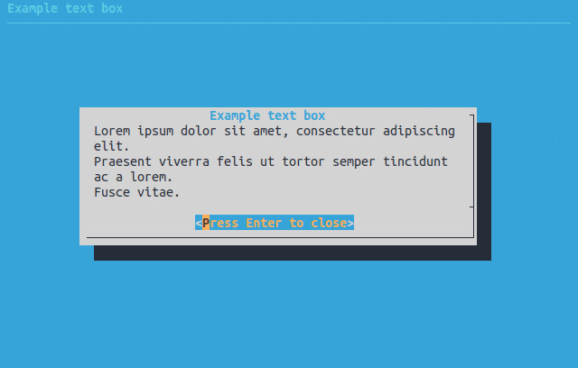
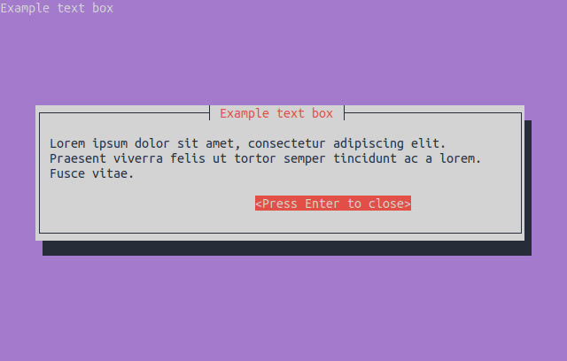
</details>

**List of commands:**
<details><summary><code>text &lt;options&gt;</code></summary><blockquote>

Sets up a new text box and draws it.
Option             | Default                                        | Description
------------------ | :--------------------------------------------: | -----------
`file=`            |                                                | <sup id="text-options-file"><sub>[#][text-options-file]</sub></sup> The path to a file whose contents to display in the text box. This takes precedence over the [`text`][box-common-options-text] option.
`follow=`          | `false`                                        | <sup id="text-options-follow"><sub>[#][text-options-follow]</sub></sup> Whether to follow the contents of the file as in `tail -f` command.<br>In Dialog, long lines can be scrolled horizontally using vi-style `h` (left) and `l` (right), or arrow-keys. A `0` resets the scrolling. In Whiptail, long lines are wrapped by default.<br>Possible values: `true` (or `1`), `false` (or `0`).
`inBackground=`    | `false`                                        | <sup id="text-options-in_background"><sub>[#][text-options-in_background]</sub></sup> Whether to follow the file in the background, as in `tail -f &` command, while displaying other widgets.<br>If no widgets are added using the `--and-widget` option, the display of the box will be postponed until another box is launched, which will then be used as widget.<br>NOTE: Dialog will perform all of the background widgets in the same process, polling for updates. You may use Tab to traverse between the widgets on the screen, and close them individually, e.g., by pressing ENTER.<br>Possible values: `true` (or `1`), `false` (or `0`).

[<strong>See Common Options</strong>](#common-options)
</blockquote></details>

---
<!-- }}} -->

### Pause<!-- {{{ -->
Component to set up a new pause box and perform drawing to the terminal. Corresponds to the `--pause` argument in Dialog.
> [!NOTE]
> In Whiptail, this feature is emulated using a [menu](#menu) box.

<details><summary><strong>Demo</strong> | <a href="./demo/pause.sh">Show example code</a></summary>

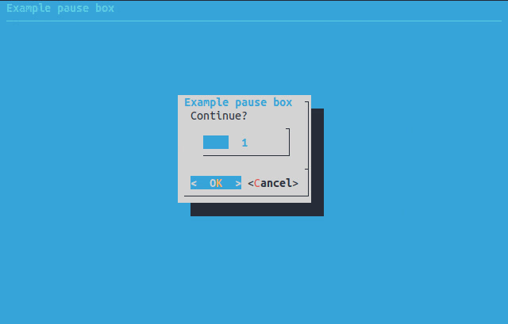
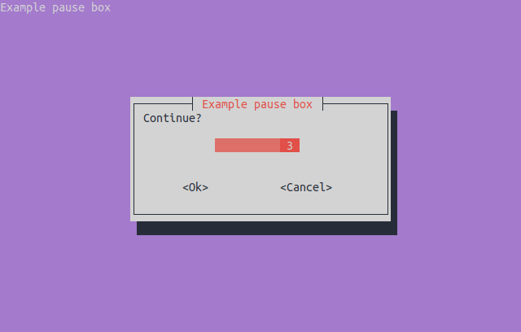
</details>

**List of commands:**
<details><summary><code>pause &lt;options&gt;</code></summary><blockquote>

Sets up a new pause box and draws it.
Option             | Default                                        | Description
------------------ | :--------------------------------------------: | -----------
`seconds=`         |                                                | <sup id="pause-options-seconds"><sub>[#][pause-options-seconds]</sub></sup> The amount of seconds to pause, after which the box will timeout.<br>The decimal part will be dropped.

[<strong>See Common Options</strong>](#common-options)
</blockquote></details>

---
<!-- }}} -->

### Program<!-- {{{ -->
Sets up a new program box that will display the output of a command. Corresponds to the `--prgbox`,
`--programbox` & `--progressbox` arguments in Dialog.
> [!NOTE]
> In Whiptail, this feature is emulated using an [input](#input) field with validation.

> [!IMPORTANT]
> When using process substitution to feed the program box, it's crucial to `wait` for the process
> substitution's PID to ensure correct behavior of the box, especially with [`hideOk="false"`][program-options-hide_ok]
> option. See example:
> ```bash
> { /bin/cmd; } > >(program text='Working in progress...') 2>&1
> wait $!
>
> # Pitfall: the result of $! could be empty if process substitution is fed by
> # an external command ('/bin/cmd' in this case). As a workaround, wrap external
> # command call using a Bash function or put everything in {...} block and
> # redirect the output of the block as shown above.
> # For more details, see https://unix.stackexchange.com/a/524844
> ```
> The rationale behind that, is because the program box reads your program's output in a separate
> subshell. Once your program finishes, the subshell running the program box will be
> effectively detached from the main Bash process. By explicitly waiting for it before exiting your
> script or launching another box, you ensure the program box can clean up the screen and restore
> TTY input settings.
>
> Also, this strictly requires **Bash v4.4** for the process substitution's PID to be `wait`able.
> For Bash v4.3, use `flock`-style locking mechanism to achieve the same.

<details><summary><strong>Demo</strong> | <a href="./demo/program.sh">Show example code</a></summary>

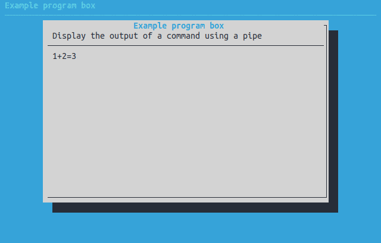
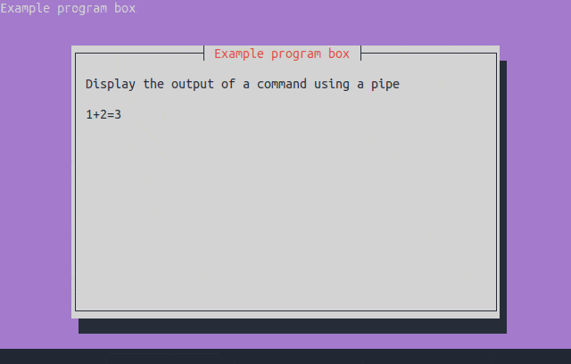
</details>

**List of commands:**
<details><summary><code>program &lt;options&gt;</code></summary><blockquote>

Sets up a new box that will display the output of a command.
Option             | Default                                        | Description
------------------ | :--------------------------------------------: | -----------
`command=`         |                                                | <sup id="program-options-command"><sub>[#][program-options-command]</sub></sup> The command(s) to execute via `sh -c <command>` whose output will be displayed in the box.<br>If omitted, then the output will be read from _stdin_.
`hideOk=`          | `false`                                        | <sup id="program-options-hide_ok"><sub>[#][program-options-hide_ok]</sub></sup> Whether to hide the `OK` button after the command has completed.<br>Possible values: `true` (or `1`), `false` (or `0`).
</details>

---
<!-- }}} -->

### Progress<!-- {{{ -->
Component to set up a new progress box, make adjustments on-the-fly, and perform drawing to the terminal. Corresponds to the `--gauge` & `--mixedgauge` arguments in _Dialog/Whiptail_.
> [!NOTE]
> In Whiptail, the mixed progress is simulated using a normal [progress](#progress).

<details><summary><strong>Demo</strong></summary>
<details><summary>progress | <a href="./demo/progress.sh">Show example code</a></summary>

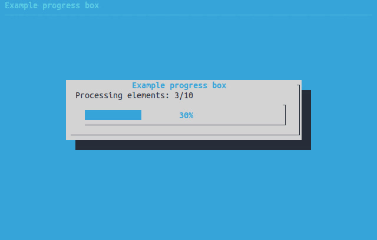
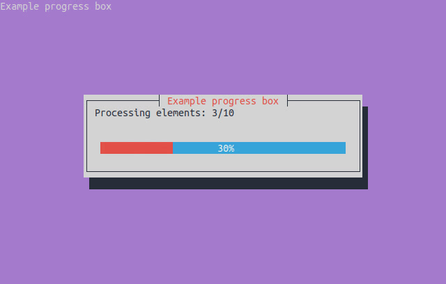
</details>

<details><summary>mixed progress | <a href="./demo/mixedprogress.sh">Show example code</a></summary>

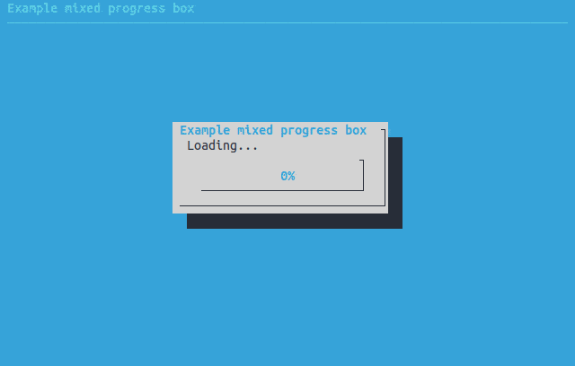
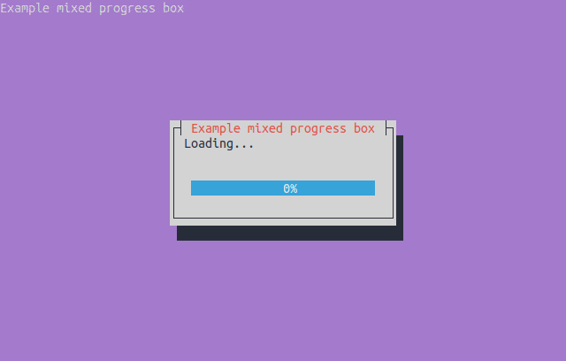
</details>
</details>

**List of commands:**
<details><summary><code>progress &lt;options&gt;</code></summary><blockquote><!-- {{{ -->

Sets up a new progress box and draws it.
Option             | Default                                        | Description
------------------ | :--------------------------------------------: | -----------
`value=`           | `0`                                            | <sup id="progress-options-value"><sub>[#][progress-options-value]</sub></sup> The initial value to calculate the percentage of the progress bar. If [`total`][progress-options-total] option is not set, then this value is the % value of the progress bar. Can be updated using [`progressSet`][progress_set-command] command.<br>Decimal part will be dropped.
`total=`           | `0`                                            | <sup id="progress-options-total"><sub>[#][progress-options-total]</sub></sup> The initial _total_ or _complete_ value used to calculate the % value that will be displayed in the progress bar. Here's the general formula: `percentage=value/total*100`. Can be updated using [`progressSet`][progress_set-command] command.<br>Decimal part will be dropped.
`entry=`           |                                                | <sup id="progress-options-entry"><sub>[#][progress-options-entry]</sub></sup> The entry (row) name to add. Each entry must be paired with a [`state`][progress-options-state] option. Any amount of entries can be added, or you can add them later with [`progressSet`][progress_set-command] command. The entry name should be unique, so that its state can be updated using [`progressSet`][progress_set-command] command.<br>**IMPORTANT:** the number of [`entry`][progress-options-entry] and [`state`][progress-options-state] options must be equal. The following example will fail (2 entries and 1 state): <code>progress entry='Entry1' state="$PROGRESS_N_A_STATE" entry='Entry2'</code>
`state=`           |                                                | <sup id="progress-options-state"><sub>[#][progress-options-state]</sub></sup> The state of the entry. The entry state can be any string. If the string starts with a leading `-` (e.g., `-20`), then it will be suffixed with a % sign, such as `20%`.<br>There are 10 special entry states encoded as digits (0-9), publicly available as numeric constant variables: <table><tr><td>`PROGRESS_SUCCEEDED_STATE` (0)</td><td>Succeeded</td></tr><tr><td>`PROGRESS_FAILED_STATE` (1)</td><td>Failed</td></tr><tr><td>`PROGRESS_PASSED_STATE` (2)</td><td>Passed</td></tr><tr><td>`PROGRESS_COMPLETED_STATE` (3)</td><td>Completed</td></tr><tr><td>`PROGRESS_CHECKED_STATE` (4)</td><td>Checked</td></tr><tr><td>`PROGRESS_DONE_STATE` (5)</td><td>Done</td></tr><tr><td>`PROGRESS_SKIPPED_STATE` (6)</td><td>Skipped</td></tr><tr><td>`PROGRESS_IN_PROGRESS_STATE` (7)</td><td>In Progress</td></tr><tr><td>`PROGRESS_BLANK_STATE` (8)</td><td>(blank)</td></tr><tr><td>`PROGRESS_N_A_STATE` (9)</td><td>N/A</td></tr></table>

[<strong>See Common Options</strong>](#common-options)
</blockquote></details>
<!-- }}} -->

<details><summary id="progress_set-command"><code>progressSet &lt;options&gt;</code></summary><blockquote><!-- {{{ -->

Performs adjustments on the progress box.
Option             | Default                                        | Description
------------------ | :--------------------------------------------: | -----------
`text=`<br>`text+=`|                                                | <sup id="progress_set-options-text"><sub>[#][progress_set-options-text]</sub></sup> The new string to display inside the progress box. The `+=` operator will concatenate with the previous `text=` value (e.g., `progressSet text='very long line1\n' text+='very long line2`).
`value=`           |                                                | <sup id="progress_set-options-value"><sub>[#][progress_set-options-value]</sub></sup> The new value to calculate the percentage of the progress bar.<br>If [`total`][progress_set-options-total] option is not set, then this value is the % value of the progress bar.<br>Decimal part will be dropped.
`total=`           |                                                | <sup id="progress_set-options-total"><sub>[#][progress_set-options-total]</sub></sup> The new _total_ or _complete_ value used to calculate the % value that will be displayed in the progress bar. Here's the general formula: `percentage=value/total*100`.<br>Decimal part will be dropped.
`entry=`           |                                                | <sup id="progress_set-options-entry"><sub>[#][progress_set-options-entry]</sub></sup> The entry (row) name to add or update, if it already exists.
`state=`           |                                                | <sup id="progress_set-options-state"><sub>[#][progress_set-options-state]</sub></sup> The state of the entry that is being added or updated.
`help`             |                                                | <sup id="progress_set-options-help"><sub>[#][progress_set-options-help]</sub></sup> Print the usage screen and exit.
</blockquote></details>
<!-- }}} -->

<details><summary><code>progressExit</code></summary><blockquote><!-- {{{ -->

Manually causes the progress box to exit. Normally, the progress box will exit automatically as soon
as it reaches 100% or when your script terminates.
Option             | Description
------------------ | -----------
`help`             | <sup id="progress_exit-help"><sub>[#][progress_exit-help]</sub></sup> Print the usage screen and exit.
</blockquote></details>
<!-- }}} -->

---
<!-- }}} -->

### Range<!-- {{{ -->
Component to set up a new range box to select from a range of values, e.g., using a slider. Corresponds to the `--rangebox`
argument in Dialog.
> [!NOTE]
> In Whiptail, this feature is emulated using an [input](#input) field with validation.

<details><summary><strong>Demo</strong> | <a href="./demo/range.sh">Show example code</a></summary>

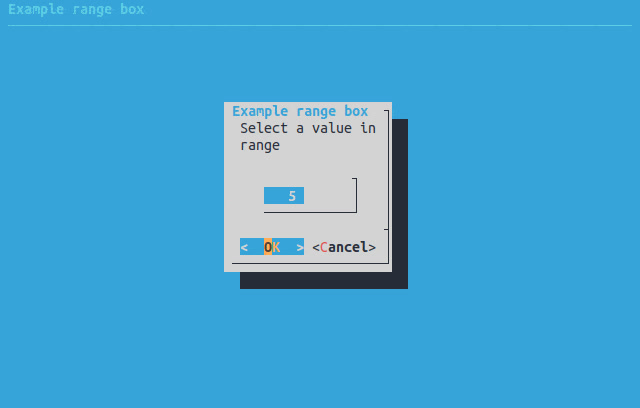
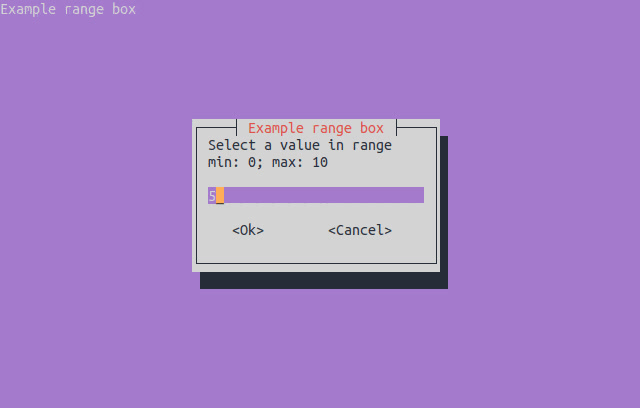
</details>

**List of commands:**
<details><summary><code>range &lt;options&gt;</code></summary><blockquote>

Sets up a new range box to select from a range of values, e.g., using a slider.
Option             | Default                                        | Description
------------------ | :--------------------------------------------: | -----------
`min=`             | `0`                                            | <sup id="range-options-min"><sub>[#][range-options-min]</sub></sup> The minimum value of the range.<br>Example: `0`.
`max=`             | _(minimum value)_                              | <sup id="range-options-max"><sub>[#][range-options-max]</sub></sup> The maximum value of the range.<br>Example: `10`.
`default=`         | _(minimum value)_                              | <sup id="range-options-default"><sub>[#][range-options-default]</sub></sup> The default value of the range.<br>Example: `5`.
</details>

---
<!-- }}} -->

### Selector<!-- {{{ -->
Component to set up a new file/directory selector box and perform drawing to the terminal. Corresponds to the `--dselect` & `--fselect` argument in Dialog.
> [!NOTE]
> In Whiptail, this feature is emulated using a [menu](#menu) box.
>
> **Path Editor:** the `Cancel` button has been replaced with `Edit/Exit`, which opens an [input](#input)
> box allowing you to edit the path, similar to how it works in Dialog.
>
> **Quick Selection:** as in Dialog, you can use incomplete paths to pre-select the first entry that partially match.
>
> **Navigation:**
> - The `.` (dot) entry selects the current directory or the string "as-is", as provided in the path editor.
> - The `..` (dot-dot) entry navigates to the parent directory.
> - Selecting an entry in the menu list will canonicalize the filepath using `realpath` command.
> - Pressing the `ESC` key exits the selector box. Alternatively, you should go through the path
>   editor box to exit.

<details><summary><strong>Demo</strong> | <a href="./demo/selector.sh">Show example code</a></summary>

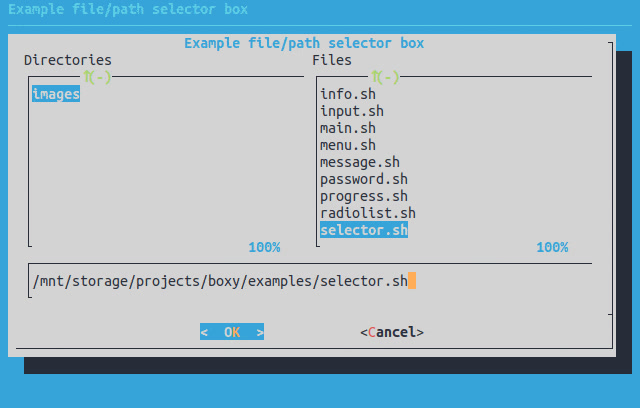
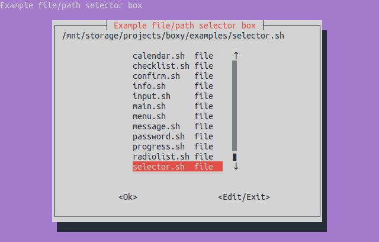
</details>

**List of commands:**
<details><summary><code>selector &lt;options&gt;</code></summary><blockquote>

Sets up a new file/directory selector box and draws it.
Option             | Default                                        | Description
------------------ | :--------------------------------------------: | -----------
`filepath=`        | `""`                                           | <sup id="selector-options-filepath"><sub>[#][selector-options-filepath]</sub></sup> The path to a file or directory. If a file path is provided, the path contents will be displayed, and the filename will be pre-selected.<br>Corresponds to the `--fselect` argument in Dialog.<br>This option is used by default.
`directory=`       | `""`                                           | <sup id="selector-options-directory"><sub>[#][selector-options-directory]</sub></sup> The path to a directory. If a file path is provided, the filename will be discarded, and the path contents will be displayed instead.<br>Corresponds to the `--dselect` argument in Dialog.<br>NOTE: only directories will be visible in the selector box when using this option.

[<strong>See Common Options</strong>](#common-options)
</blockquote></details>

---
<!-- }}} -->

### Timepicker<!-- {{{ -->
Component to set up a new time picker box and perform drawing to the terminal. Corresponds to the `--timebox` argument in Dialog.
> [!NOTE]
> In Whiptail, this feature is emulated using an [input](#input) field with validation.
> The output (as well as the input) defaults to the format `hh:mm:ss`.

<details><summary><strong>Demo</strong> | <a href="./demo/timepicker.sh">Show example code</a></summary>

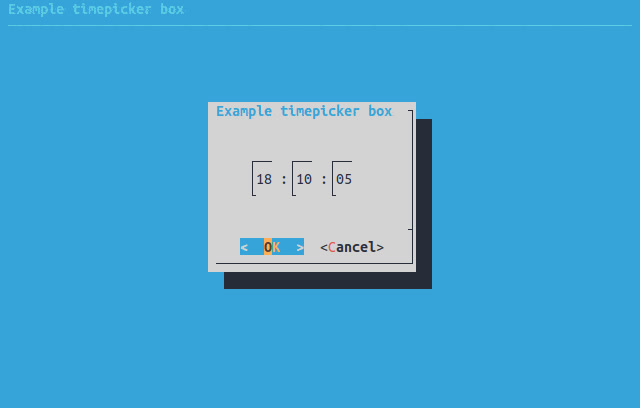
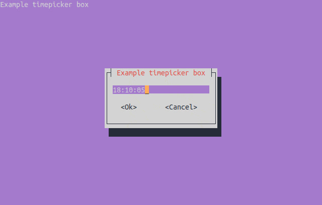
</details>

**List of commands:**
<details><summary><code>timepicker &lt;options&gt;</code></summary><blockquote>

Sets up a new time box and draws it.
Option             | Default                                        | Description
------------------ | :--------------------------------------------: | -----------
`hour=`            | _(current hour)_                               | <sup id="timepicker-options-hour"><sub>[#][timepicker-options-hour]</sub></sup> The hour of the time picker.<br>Example: `15`.
`minute=`          | _(current minute)_                             | <sup id="timepicker-options-minute"><sub>[#][timepicker-options-minute]</sub></sup> The minute of the time picker.<br>Example: `10`.
`second=`          | _(current second)_                             | <sup id="timepicker-options-second"><sub>[#][timepicker-options-second]</sub></sup> The second of the time picker.<br>Example: `59`.
`timeFormat=`      | `%H:%M:%S`                                     | <sup id="timepicker-options-time_format"><sub>[#][timepicker-options-time_format]</sub></sup> The format of the outputted time string.<br>NOTE: in Dialog, the `--time-format` option will be used, which relies on `strftime`, whereas in Whiptail, the `date` command will be used. So, there may be slight differences in the format specifiers.
`forceInputBox=`   | `false`                                        | <sup id="timepicker-options-force_input_box"><sub>[#][timepicker-options-force_input_box]</sub></sup> Whether to force use of the [input](#input) box instead of the Dialog's time box.<br>Possible values: `true` (or `1`), `false` (or `0`).

[<strong>See Common Options</strong>](#common-options)
</blockquote></details>
<!-- }}} -->
<!-- Box }}} -->
<!-- Components }}} -->

# Communication between boxes<!-- {{{ -->
The boxlib simplifies not only box creation but also interaction between boxes and result capture.

<details><summary><strong>Result capture</strong></summary><blockquote><!-- {{{ -->

When no callbacks are attached to a box or its entries, or if the [`printResult=true`][box-common-options-print_result]
option is set, the result(s) will be printed to stdout, one per line, after the box exited.
Otherwise, the callback should expect the result(s) as input parameters.
</blockquote></details>
<!-- }}} -->

<details><summary><strong>Exit code capture</strong></summary><blockquote><!-- {{{ -->

Unless a callback is specified via [`callback`][box-common-options-callback] option on the box
or its entries, or the [`propagateCallbackExitCode=false`][box-common-options-propagate_callback_exit_code]
option is set, all boxes will exit with the status code returned by the corresponding Whiptail/Dialog
box (see the DIAGNOSTICS section in the man page for codes). Otherwise, the `$?` variable will hold
the box's exit code at the time the callback is invoked.

<details><summary>Status code propagation example</summary><!-- {{{ -->

In this example, we create a radio list box that allows users to perform file actions on a dummy file.
Observe how the return code is propagated backwards through the whole callback chain, up to the parent
box, which is the radio list box.

```bash
FILE='/path/to/dummy/file.txt'

OPERATION_NOT_PERMITTED_CODE=5

function main() {
  list \
    type='radio' \
    title='Actions with file' \
    text="Choose what to do with file: $FILE\n" \
    text+="or press ESC to cancel" \
    printResult='true' # note that we need 'printResult' option to capture the choice
                       # name, so we can match it with the return status code
  
  listEntry title='Open' callback='open_file_handler()'
  listEntry title='Delete' callback='delete_file_handler()'
  
  choice="$(listDraw)"
  result_code=$?
  case "$choice" in
    Open) echo 'Open: status code:' $result_code;;
    Delete)
      case $result_code in
        "$OPERATION_NOT_PERMITTED_CODE")
        echo 'Delete: error: Operation not permitted.'
        ;;
        *) echo 'Delete: exit code' $result_code
      esac
      ;;
    *) echo 'User has not made a choice or canceled the radio list. ' \
        'Exit code: ' $result_code
  esac
}

function open_file_handler() {
  return 0
}

function delete_file_handler() {
  confirm \
    title='Delete file' \
    text="This action will delete the file: $FILE\n\n" \
    text+='Are you sure you want to continue?' \
  callback='confirm_delete_file_handler()'
  return $? # <= this is the return code from the confirm box callback
}

function confirm_delete_file_handler() {
  # Capture the status code from the confirm box
  local status=$?
  # The user answered "Yes"
  if [ $status -eq 0 ]; then
    # Simulate something went wrong, and we want to exit with a specific code
    return 5
  fi
  # Otherwise, propagate the code further, as the user could cancel the confirm
  # box with ESC key, which will return 255 instead
  return $status
}

main
```

When _Open_ is selected, this is the expected output in terminal:
```console
Open: status code: 0
```

When _Delete_ is selected and user answered "Yes", this is the expected output in terminal:
```console
Delete: error: Operation not permitted.
```

</details>
</blockquote></details>
<!-- Status code propagation example }}} -->
<!-- }}} -->

<details><summary><strong>Variable capture</strong></summary><blockquote><!-- {{{ -->

When using functions or sourceable shell-scripts as [`callback`][box-common-options-callback], you can
easily pass arbitrary data to the parent box using the Bash builtin `export` command to mark variables
for automatic export to the environment.

**Example:**
```bash
data='abcd'
export key='value'

function cb() {
  # The variable won't be passed to the parent's environment variable space, as
  # boxlib captures only global exported variables
  data='123'

  # Since the 'key' variable is already exported in the parent, it can be changed
  key='efgh'

  # This variable is (globally) declared in the callback's sandbox (sub-shell),
  # so it must be exported
  myVar='123'
  export myVar # or export myVar='123'

  # You can also export arrays with -x key (NOTE: also need -g or it will be local to
  # this function)
  declare -gx -a myArr=(1 2 3)

  # Or you can un-export a parent's variable to ensure changes will remain in
  # the callbacks's sandbox
  export -n dummy
  dummy=2
}

echo 'Before box start.'
export dummy=1
declare -p dummy # => declare -x dummy="1"
echo

confirm title='Test' callback='cb()'

echo
echo "data=$data" # => abcd
echo "key=$key" # => efgh
echo "myVar=$myVar" # => 123
echo "myArr=(${myArr[*]})" # => (1 2 3)
declare -p dummy # => declare -x dummy="1"
```

> **Must Know:** since callbacks are executed in a "sandboxed" environment (i.e., a sub-shell) to
> prevent pollution and collisions, the boxlib implements the callback environment propagation
> mechanism. This mechanism migrates **ONLY** exported variables to the parent's environment
> variable space after the callback exits.
>
> If you're going to use the callback environment propagation mechanism, note that it runs right
> after the callback exits. Using `exit` in your callbacks prevents the environment variable space
> propagation, as it causes the whole sandbox to exit earlier. **ALWAYS** use `return` instead,
> even in sourceable shell-scripts.
</blockquote></details>
<!-- }}} -->
<!-- Communication between boxes }}} -->

# Global variables<!-- {{{ -->
<details><summary><code id="global-vars-use-whiptail">$BOXLIB_USE_WHIPTAIL=1</code></summary><blockquote>

This environment variable, when set to `1`, will force Whiptail as renderer.
The [rendererPath][config-options-renderer_path]/[rendererName][config-options-renderer_name] options
will still take precedence, though. Example usage:
> ```bash
> BOXLIB_USE_WHIPTAIL=1 ./my_app/main.sh 1 # or BOXLIB_USE_WHIPTAIL=1 bash ./my_app/main.sh
> ```
</blockquote></details>

<details><summary><code id="global-vars-debug">$BOXLIB_DEBUG=/path/to/file</code></summary><blockquote>

This environment variable enables debug printing to file or terminal. It also accepts the
[debug][config-options-debug] option values. The latter (if used), will still take precedence,
though. Example usage:
> ```bash
> BOXLIB_DEBUG=stderr ./my_app/main.sh 1 # or BOXLIB_DEBUG=stderr bash ./my_app/main.sh
> ```
</blockquote></details>

<details><summary><code>$BOXLIB_LOADED</code></summary><blockquote>

This read-only variable is set after the library has been loaded (sourced). Example usage:
```bash
if [ ${BOXLIB_LOADED+xyz} ]; then
  echo 'boxlib is loaded.'
else
  echo 'boxlib is not loaded.'
fi
```
</blockquote></details>
<!-- }}} -->

# Troubleshooting<!-- {{{ -->
- Set the [`BOXLIB_DEBUG`][global-vars-debug] environment variable, or the [`debug`][config-options-debug]
option at the very top of the file (e.g., the entrypoint script) to record logs (including backend
renderer errors) to a file or print them all to terminal.

- On some unexpected box render failures or if you happened to hit `Ctrl+C` during box drawing,
the terminal may be left in a messed-up state (e.g., an invisible cursor, leftovers of the boxes, etc.).
To fix your terminal, type the `reset` command, even if the input is invisible.
<!-- }}} -->

# Useful links<!-- {{{ -->
- [Whiptail man page](https://manpages.ubuntu.com/manpages/xenial/man1/whiptail.1.html)
- [Dialog man page](https://manpages.ubuntu.com/manpages/xenial/man1/dialog.1.html)
- [Submodule/Subtree Cheatsheet](https://training.github.com/downloads/submodule-vs-subtree-cheat-sheet/)
<!-- }}} -->

<!-- Aliases for reusable links {{{
Usage:
  [Go to "example.com"][alias-name]
  ...
  [alias-name]: https://example.com
-->
[tags/url]: https://github.com/iusmac/boxlib/tags
[tags/latest-tag-badge]: https://img.shields.io/github/v/tag/iusmac/boxlib?sort=semver&style=for-the-badge
[license-badge]: https://img.shields.io/github/license/iusmac/boxlib?style=for-the-badge
[config-options-header_title]: #user-content-config-options-header_title
[config-options-renderer_path]: #user-content-config-options-renderer_path
[config-options-renderer_name]: #user-content-config-options-renderer_name
[config-options-breadcrumbs_delim]: #user-content-config-options-breadcrumbs_delim
[config-options-debug]: #user-content-config-options-debug
[config-options-is_dialog_renderer]: #user-content-config-options-is_dialog_renderer
[config-options-reset]: #user-content-config-options-reset
[config-options-help]: #user-content-config-options-help
[box-common-options-title]: #user-content-box-common-options-title
[box-common-options-text]: #user-content-box-common-options-text
[box-common-options-width]: #user-content-box-common-options-width
[box-common-options-height]: #user-content-box-common-options-height
[box-common-options-callback]: #user-content-box-common-options-callback
[box-common-options-change_to_callback_dir]: #user-content-box-common-options-change_to_callback_dir
[box-common-options-abort_on_callback_failure]: #user-content-box-common-options-abort_on_callback_failure
[box-common-options-propagate_callback_exit_code]: #user-content-box-common-options-propagate_callback_exit_code
[box-common-options-always_invoke_callback]: #user-content-box-common-options-always_invoke_callback
[box-common-options-print_result]: #user-content-box-common-options-print_result
[box-common-options-abort_on_renderer_failure]: #user-content-box-common-options-abort_on_renderer_failure
[box-common-options-loop]: #user-content-box-common-options-loop
[box-common-options-hide_breadcrumb]: #user-content-box-common-options-hide_breadcrumb
[box-common-options-sleep]: #user-content-box-common-options-sleep
[box-common-options-timeout]: #user-content-box-common-options-timeout
[box-common-options-term]: #user-content-box-common-options-term
[box-common-options-round-bracket-syntax]: #user-content-box-common-options-round-bracket-syntax
[box-common-options-yes_label]: #user-content-box-common-options-yes_label
[box-common-options-no_label]: #user-content-box-common-options-no_label
[box-common-options-ok_label]: #user-content-box-common-options-ok_label
[box-common-options-cancel_label]: #user-content-box-common-options-cancel_label
[box-common-options-scrollbar]: #user-content-box-common-options-scrollbar
[box-common-options-topleft]: #user-content-box-common-options-topleft
[box-common-options-help]: #user-content-box-common-options-help
[calendar-options-day]: #user-content-calendar-options-day
[calendar-options-month]: #user-content-calendar-options-month
[calendar-options-year]: #user-content-calendar-options-year
[calendar-options-date_format]: #user-content-calendar-options-date_format
[calendar-options-force_input_box]: #user-content-calendar-options-force_input_box
[edit-options-file]: #user-content-edit-options-file
[edit-options-editor]: #user-content-edit-options-editor
[edit-options-in_place]: #user-content-edit-options-in_place
[form-options-form_height]: #user-content-form-options-form_height
[form-options-columns]: #user-content-form-options-columns
[form-options-field_max_length]: #user-content-form-options-field_max_length
[form-options-field_width]: #user-content-form-options-field_width
[form-options-square-bracket-syntax]: #user-content-form-options-square-bracket-syntax
[form_field]: #user-content-form_field
[form_field-options-type]: #user-content-form_field-options-type
[form_field-options-title]: #user-content-form_field-options-title
[form_field-options-value]: #user-content-form_field-options-value
[form_field-options-width]: #user-content-form_field-options-width
[form_field-options-maxlength]: #user-content-form_field-options-maxlength
[form_field-options-title_x]: #user-content-form_field-options-title_x
[form_field-options-title_y]: #user-content-form_field-options-title_y
[form_field-options-value_x]: #user-content-form_field-options-value_x
[form_field-options-value_y]: #user-content-form_field-options-value_y
[form_field-options-help]: #user-content-form_field-options-help
[form_draw-options-help]: #user-content-form_draw-options-help
[info-options-clear]: #user-content-info-options-clear
[input-options-type]: #user-content-input-options-type
[input-options-value]: #user-content-input-options-value
[list-options-type]: #user-content-list-options-type
[list-options-list_height]: #user-content-list-options-list_height
[list-options-prefix]: #user-content-list-options-prefix
[list-options-keep_prefix]: #user-content-list-options-keep_prefix
[list-options-square-bracket-syntax]: #user-content-list-options-square-bracket-syntax
[list_entry]: #user-content-list_entry
[list_entry-options-title]: #user-content-list_entry-options-title
[list_entry-options-summary]: #user-content-list_entry-options-summary
[list_entry-options-selected]: #user-content-list_entry-options-selected
[list_entry-options-depth]: #user-content-list_entry-options-depth
[list_entry-options-callback]: #user-content-list_entry-options-callback
[list_entry-options-help]: #user-content-list_entry-options-help
[list_draw-options-help]: #user-content-list_draw-options-help
[menu-options-menu_height]: #user-content-menu-options-menu_height
[menu-options-prefix]: #user-content-menu-options-prefix
[menu-options-keep_prefix]: #user-content-menu-options-keep_prefix
[menu-options-rename]: #user-content-menu-options-rename
[menu-options-square-bracket-syntax]: #user-content-menu-options-square-bracket-syntax
[menu_entry]: #user-content-menu_entry
[menu_entry-options-title]: #user-content-menu_entry-options-title
[menu_entry-options-summary]: #user-content-menu_entry-options-summary
[menu_entry-options-selected]: #user-content-menu_entry-options-selected
[menu_entry-options-callback]: #user-content-menu_entry-options-callback
[menu_entry-options-help]: #user-content-menu_entry-options-help
[menu_draw-options-help]: #user-content-menu_draw-options-help
[text-options-file]: #user-content-text-options-file
[text-options-follow]: #user-content-text-options-follow
[text-options-in_background]: #user-content-text-options-in_background
[pause-options-seconds]: #user-content-pause-options-seconds
[program-options-command]: #user-content-program-options-command
[program-options-hide_ok]: #user-content-program-options-hide_ok
[progress-options-value]: #user-content-progress-options-value
[progress-options-total]: #user-content-progress-options-total
[progress-options-entry]: #user-content-progress-options-entry
[progress-options-state]: #user-content-progress-options-state
[progress_set-command]: #user-content-progress_set-command
[progress_set-options-text]: #user-content-progress_set-options-text
[progress_set-options-value]: #user-content-progress_set-options-value
[progress_set-options-total]: #user-content-progress_set-options-total
[progress_set-options-entry]: #user-content-progress_set-options-entry
[progress_set-options-state]: #user-content-progress_set-options-state
[progress_set-options-help]: #user-content-progress_set-options-help
[progress_exit-help]: #user-content-progress_exit-help
[range-options-min]: #user-content-range-options-min
[range-options-max]: #user-content-range-options-max
[range-options-default]: #user-content-range-options-default
[selector-options-filepath]: #user-content-selector-options-filepath
[selector-options-directory]: #user-content-selector-options-directory
[timepicker-options-hour]: #user-content-timepicker-options-hour
[timepicker-options-minute]: #user-content-timepicker-options-minute
[timepicker-options-second]: #user-content-timepicker-options-second
[timepicker-options-time_format]: #user-content-timepicker-options-time_format
[timepicker-options-force_input_box]: #user-content-timepicker-options-force_input_box
[global-vars-use-whiptail]: #user-content-global-vars-use-whiptail
[global-vars-debug]: #user-content-global-vars-debug
<!-- }}}
vim: set fdm=marker: -->
